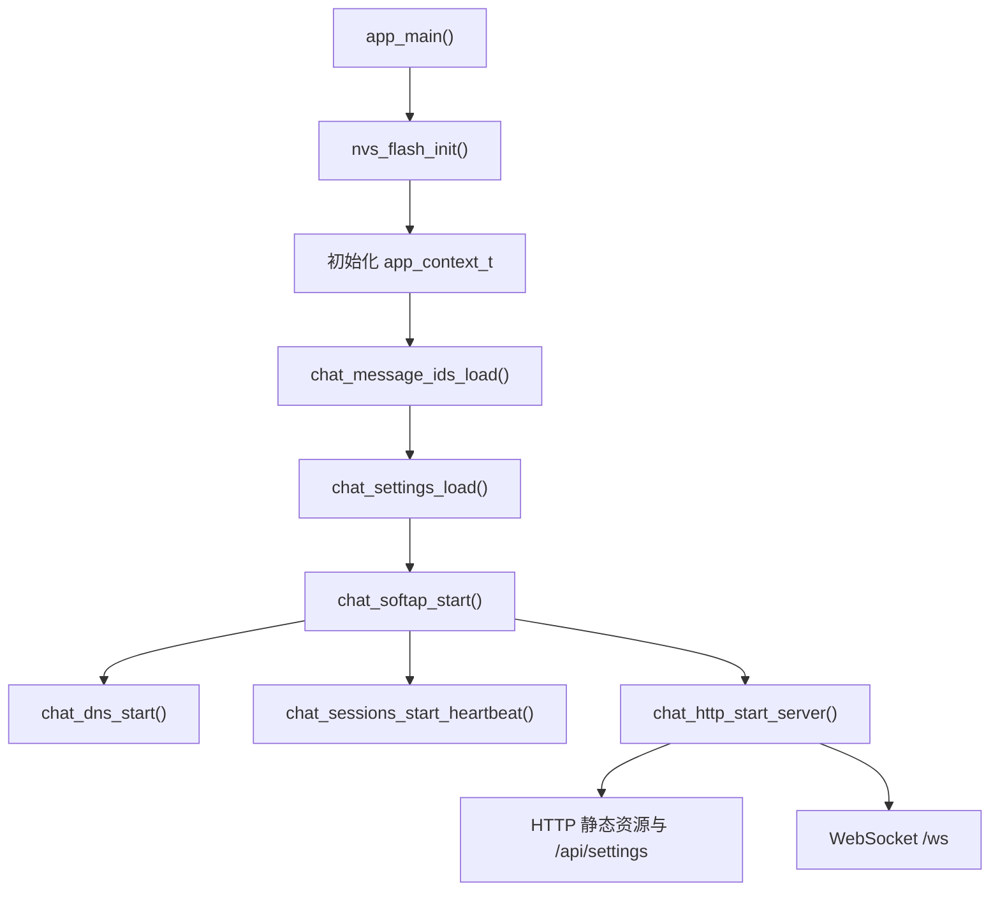
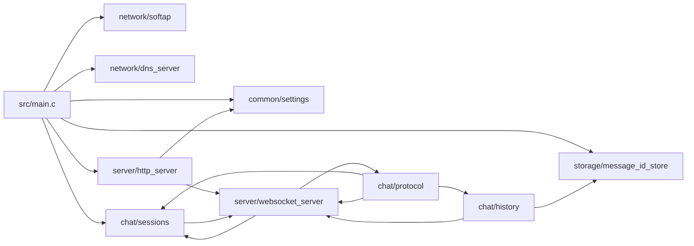

# Architecture

本文档说明设备端的模块边界、启动流程、共享状态和并发模型。

## 启动流程

`src/main.c` 只做启动编排，不承载业务逻辑。后续如果新增系统级服务，也应只在这里调用模块启动函数。

## 共享上下文

`app_context_t` 位于 `main/include/app_context.h`，是拆分后唯一的跨模块状态容器。

它包含：

- `client_slots` 和 `client_mutex`：在线 WebSocket 客户端槽位。
- `message_buffer`、`message_id_counter`、`boot_start_id`、`message_buffer_head` 和 `message_mutex`：最近消息缓存与 ID 边界。
- `settings`：当前运行中的热点与管理员设置。
- `server` 和 `httpd_task_handle`：ESP-IDF HTTP Server 状态。

实现约定：

- 全局实例是 `g_app_context`，定义在 `src/main.c`。
- 模块函数优先显式接收 `app_context_t *ctx`。
- ESP-IDF 回调无法直接传上下文时，可以回退使用 `g_app_context`。

## 模块依赖

`server` 层负责传输，`chat` 层负责业务。`storage` 不直接了解 WebSocket 或 HTTP。

## 任务模型

| 任务 | 创建位置 | 职责 |
| --- | --- | --- |
| HTTPD task | ESP-IDF HTTP Server 内部创建 | 处理 HTTP 和 WebSocket 回调 |
| DNS task | `chat_dns_start()` | UDP 53 DNS 劫持 |
| heartbeat task | `chat_sessions_start_heartbeat()` | 定时 ping 客户端并清理失活连接 |
| restart task | `server/http_server.c` | 设置保存后延迟重启 |

## 锁边界

| 锁 | 保护内容 | 使用模块 |
| --- | --- | --- |
| `client_mutex` | `client_slots` | `chat/sessions.c`、`server/websocket_server.c`、`chat/protocol.c` |
| `message_mutex` | `message_buffer`、消息 ID、历史边界 | `chat/history.c` |

规则：

- 持锁时只做内存状态读写，避免长时间网络发送。
- 需要广播时，先拷贝 fd 或构造 payload，再释放锁发送。
- 消息入库和消息 ID 持久化在 `chat_history_finalize_and_store_message()` 中串行执行。

## 静态资源嵌入

前端资源位于 `main/web`，通过 `main/CMakeLists.txt` 的 `EMBED_FILES` 编译进固件。虽然文件在子目录中，HTTP 仍对外暴露旧路径：

- `web/index.html` -> `/`
- `web/css/style.css` -> `/style.css`
- `web/js/script.js` -> `/script.js`
- `web/assets/favicon.ico` -> `/favicon.ico`
